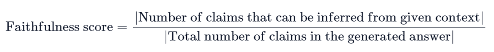

# Prompt-based Evaluation
Prompt-based evaluation uses LLM as to evaluate different aspects of RAG pipeline responses. <br>
Usually LLMs used for evaluation are models with very strong reasoning capability (GPT-4) or models specifically fine-tuned to perform evaluation task (Judge-LLM, Prometheus)
- [GPT-4](https://arxiv.org/abs/2303.16634)
- [JudgeLLM](https://arxiv.org/abs/2310.17631)
- [Prometheus](https://arxiv.org/abs/2310.08491)

## Main Evaluation Criteria for RAG Pipeline

`Retrieval`: Quality of the retrieval system

- Are the retrieved contexts relevant to the queries (Precision)?
- Does the retriever retrieve enough contexts for LLM to generate correct responses (Recall)? 

`Generation`: Quality of the generated response

- Does the response match the given context (or is LLM hallucinating)
- Does the response match the query (or is LLM hallucinating)
- Is the response correct or following certain output requirements (guidelines)<br><br>


# I. LlamaIndex LLM-based Evaluation

References: From [LLamaIndex Evaluation](https://gpt-index.readthedocs.io/en/stable/optimizing/evaluation/evaluation.html).
- [Faithfulness](https://gpt-index.readthedocs.io/en/stable/examples/evaluation/faithfulness_eval.html)
- [Relevancy](https://gpt-index.readthedocs.io/en/stable/examples/evaluation/relevancy_eval.html)
- [Correctness](https://gpt-index.readthedocs.io/en/stable/examples/evaluation/correctness_eval.html)
- [Guideline Adherence](https://gpt-index.readthedocs.io/en/stable/examples/evaluation/guideline_eval.html)
- [Pairwise Comparison](https://gpt-index.readthedocs.io/en/stable/examples/evaluation/pairwise_eval.html)

## **Summary**
| Metric | | Query | Response | Context | Reference | 
| - | - | - | - | - | - |
| Faithfulness | | NO | YES | YES | NO
| Relevancy | | YES | YES | YES | NO |
| Correctness | | YES | YES | NO | YES |
| Guideline Adherence |  | YES | YES | NO | NO |
| Pairwise |  | YES | YES | NO | YES |

## 0. Base Evaluator Class:
To implement a custom Evaluator Class, create a subclass and overide **aevaluate/aevaluate_response** methods.
```
class BaseEvaluator(ABC):

    @abstractmethod
    async def aevaluate(
        self,
        query: Optional[str] = None,
        response: Optional[str] = None,
        contexts: Optional[Sequence[str]] = None,
        **kwargs: Any,
    ) -> EvaluationResult:
        """Run evaluation with query string, retrieved contexts,
        and generated response string.
        """
        raise NotImplementedError

    async def aevaluate_response(
        self,
        query: Optional[str] = None,
        response: Optional[Response] = None,
        **kwargs: Any,
    ) -> EvaluationResult:
        """Run evaluation with query string and generated Response object.
        """
        if response is not None:
            response_str = response.response
            contexts = [node.get_content() for node in response.source_nodes]

        return await self.aevaluate(
            query=query, response=response_str, contexts=contexts, **kwargs
        )
```

Depending on the evaluation metrics, the score can be one of the following

```
class EvaluationResult(BaseModel):
    """Evaluation result.

    Output of an BaseEvaluator.
    """

    query: Optional[str] = Field(None, description="Query string")
    contexts: Optional[Sequence[str]] = Field(None, description="Context strings")
    response: Optional[str] = Field(None, description="Response string")
    passing: Optional[bool] = Field(None, description="Binary evaluation result (passing or not)")
    feedback: Optional[str] = Field(None, description="Feedback or reasoning for the response")
    score: Optional[float] = Field(None, description="Score for the response")
```
## 1. Relevancy Evaluator
Check if contexts and responses are relevant to query.
- YES: Passing = True, Score = 1.0
- NO: Passing = False, Score = 0.0

### Prompts
```
DEFAULT_EVAL_TEMPLATE = PromptTemplate(
    "Your task is to evaluate if the response for the query \
    is in line with the context information provided.\n"
    "You have two options to answer. Either YES/ NO.\n"
    "Answer - YES, if the response for the query \
    is in line with context information otherwise NO.\n"
    "Query and Response: \n {query_str}\n"
    "Context: \n {context_str}\n"
    "Answer: "
)

DEFAULT_REFINE_TEMPLATE = PromptTemplate(
    "We want to understand if the following query and response is"
    "in line with the context information: \n {query_str}\n"
    "We have provided an existing YES/NO answer: \n {existing_answer}\n"
    "We have the opportunity to refine the existing answer "
    "(only if needed) with some more context below.\n"
    "------------\n"
    "{context_msg}\n"
    "------------\n"
    "If the existing answer was already YES, still answer YES. "
    "If the information is present in the new context, answer YES. "
    "Otherwise answer NO.\n"
)
```

### Usage
```
from llama_index.evaluation import RelevancyEvaluator
from llama_index import ServiceContext

query_engine = vector_index.as_query_engine(similarity_top_k=3)

service_context = ServiceContext(llm=OpenAI(model="gpt-4"), temperature=0, max_tokens=512)
relevancy_evaluator = RelevancyEvaluator(service_context=service_context)

sample_query = "input query"
response = query_engine.query(sample_query) # Response Object
```

```
# Evaluate 1
eval_result = relevancy_evaluator.evaluate(
    query=query,
    response=str(response),
    contexts=[node.get_content() for node in response.source_nodes],
)

# Evaluate 2
eval_result = relevancy_evaluator.evaluate_response(
    query=query,
    response=response
)
```

## 2. Faithfulness Evaluator
Check if the response is relevant to the contexts (or hallucination).

- YES: passing=True, score=1.0
- NO: passing=False, score=0.0

### Prompt
```
DEFAULT_EVAL_TEMPLATE = PromptTemplate(
    "Please tell if a given piece of information "
    "is supported by the context.\n"
    "You need to answer with either YES or NO.\n"
    "Answer YES if any of the context supports the information, even "
    "if most of the context is unrelated. "
    "Some examples are provided below. \n\n"
    "Information: Apple pie is generally double-crusted.\n"
    "Context: An apple pie is a fruit pie in which the principal filling "
    "ingredient is apples. \n"
    "Apple pie is often served with whipped cream, ice cream "
    "('apple pie à la mode'), custard or cheddar cheese.\n"
    "It is generally double-crusted, with pastry both above "
    "and below the filling; the upper crust may be solid or "
    "latticed (woven of crosswise strips).\n"
    "Answer: YES\n"
    "Information: Apple pies tastes bad.\n"
    "Context: An apple pie is a fruit pie in which the principal filling "
    "ingredient is apples. \n"
    "Apple pie is often served with whipped cream, ice cream "
    "('apple pie à la mode'), custard or cheddar cheese.\n"
    "It is generally double-crusted, with pastry both above "
    "and below the filling; the upper crust may be solid or "
    "latticed (woven of crosswise strips).\n"
    "Answer: NO\n"
    "Information: {query_str}\n"
    "Context: {context_str}\n"
    "Answer: "
)

DEFAULT_REFINE_TEMPLATE = PromptTemplate(
    "We want to understand if the following information is present "
    "in the context information: {query_str}\n"
    "We have provided an existing YES/NO answer: {existing_answer}\n"
    "We have the opportunity to refine the existing answer "
    "(only if needed) with some more context below.\n"
    "------------\n"
    "{context_msg}\n"
    "------------\n"
    "If the existing answer was already YES, still answer YES. "
    "If the information is present in the new context, answer YES. "
    "Otherwise answer NO.\n"
)
```

### Usage
```
from llama_index.evaluation import RelevancyEvaluator
from llama_index import ServiceContext

query_engine = vector_index.as_query_engine(similarity_top_k=3)

service_context = ServiceContext(llm=OpenAI(model="gpt-4"), temperature=0, max_tokens=512)
faithfulness_evaluator = FaithfulnessEvaluator(service_context=service_context)

sample_query = "input query"
response = query_engine.query(sample_query) # Response Object
```

```
# Evaluate 1
eval_result = faithfulness_evaluator.evaluate(
    response=str(response),
    contexts=[node.get_content() for node in response.source_nodes],
)

# Evaluate 2
eval_result = faithfulness_evaluator.evaluate_response(
    query=query,
    response=response
)
```

## 3. Correctness
Given the **query**, compare the correctiness between **response** and **reference** answers.
Output a score between 1 - 5. If score > **passing_threshold** (default = 4.0), passing = True else False.

### Prompt
```
DEFAULT_SYSTEM_TEMPLATE = """
You are an expert evaluation system for a question answering chatbot.

You are given the following information:
- a user query,
- a reference answer, and
- a generated answer.

Your job is to judge the relevance and correctness of the generated answer.
Output a single score that represents a holistic evaluation.
You must return your response in a line with only the score.
Do not return answers in any other format.
On a separate line provide your reasoning for the score as well.

Follow these guidelines for scoring:
- Your score has to be between 1 and 5, where 1 is the worst and 5 is the best.
- If the generated answer is not relevant to the user query, \
you should give a score of 1.
- If the generated answer is relevant but contains mistakes, \
you should give a score between 2 and 3.
- If the generated answer is relevant and fully correct, \
you should give a score between 4 and 5.

Example Response:
4.0
The generated answer has the exact same metrics as the reference answer, \
    but it is not as concise.

"""

DEFAULT_USER_TEMPLATE = """
## User Query
{query}

## Reference Answer
{reference_answer}

## Generated Answer
{generated_answer}
"""

DEFAULT_EVAL_TEMPLATE = ChatPromptTemplate(
    message_templates=[
        ChatMessage(role=MessageRole.SYSTEM, content=DEFAULT_SYSTEM_TEMPLATE),
        ChatMessage(role=MessageRole.USER, content=DEFAULT_USER_TEMPLATE),
    ]
)
```

### Usage
```
from llama_index.evaluation import CorrectnessEvaluator
from llama_index import ServiceContext

query_engine = vector_index.as_query_engine(similarity_top_k=3)

service_context = ServiceContext(llm=OpenAI(model="gpt-4"), temperature=0, max_tokens=512)
correctness_evaluator = CorrectnessEvaluator(service_context=service_context, score_threshold=4.0)

sample_query = "input query"
response = query_engine.query(sample_query) # Response Object
```

```
# Evaluate 1
sample_reference = "reference_answer
eval_result = correctness_evaluator.evaluate(
    query=query
    response=str(response),
    reference=sample_reference
)

# Evaluate 2
eval_result = correctness_evaluator.evaluate_response(
    query=query,
    response=response,
    reference=sample_reference
)
```

## 4. Guideline Adherence
Given a set of criteria (guidelines), determine whether the responses pass the guidelines.
Check if the response is relevant to the contexts (or hallucination).

- YES: passing=True, score=1.0
- NO: passing=False, score=0.0

### Prompt
```
DEFAULT_EVAL_TEMPLATE = PromptTemplate(
    "Here is the original query:\n"
    "Query: {query}\n"
    "Critique the following response based on the guidelines below:\n"
    "Response: {response}\n"
    "Guidelines: {guidelines}\n"
    "Now please provide constructive criticism.\n"
)
```

### Usage
```
from llama_index.evaluation import GuidelineEvaluator
from llama_index import ServiceContext

query_engine = vector_index.as_query_engine(similarity_top_k=3)

guidelines = "GUIDELINES"
service_context = ServiceContext(llm=OpenAI(model="gpt-4"), temperature=0, max_tokens=512)
guidelines_evaluator = GuidelineEvaluator(
    service_context=service_context,
    guidelines=guidelines
    )

sample_query = "input query"
response = query_engine.query(sample_query) # Response Object
```

```
# Evaluate 1
eval_result = correctness_evaluator.evaluate(
    query=query
    response=str(response),
)

# Evaluate 2
eval_result = correctness_evaluator.evaluate_response(
    query=query,
    response=response,
)
```

## 5. Pairwise Comparison
Given a user query and 2 answer choices, return if the first or second answer is better or a TIE.

**NOTE**: LLMs are know to have positional bias as it tend to prefer first answer choice [LLMs are not fair evaluators](https://arxiv.org/abs/2305.17926). To mitigate this, the author in the paper proposes for each pairwise evaluation, both order of choices are evaluated and the score is aggregated across 2 runs (**Balanced Position Calibration**). If the choice disagree favoring different answer choices for different runs, return **TIE**.

### Prompt
```
DEFAULT_SYSTEM_TEMPLATE = """
You are an expert evaluation system for a question answering chatbot.

You are given the following information:
- a user query,
- Answer 1
- Answer 2


Your job is to output whether Answer 1 is better, or Answer 2 is better, or
they are equally good at answering the user query.

Output "1" if Answer 1 is better, "2" if Answer 2 is better, and \
    "TIE" if they are equally good.

Please output two lines:
- first line: "1", "2", or "TIE"
- second line: a short explanation for your decision.
"""

DEFAULT_USER_TEMPLATE = """
## User Query
{query}

## Answer 1
{reference_answer}

## Answer 2
{generated_answer}
"""

DEFAULT_EVAL_TEMPLATE = ChatPromptTemplate(
    message_templates=[
        ChatMessage(role=MessageRole.SYSTEM, content=DEFAULT_SYSTEM_TEMPLATE),
        ChatMessage(role=MessageRole.USER, content=DEFAULT_USER_TEMPLATE),
    ]
)
```

### Usage
```
from llama_index.evaluation import PairwiseComparisonEvaluator
from llama_index import ServiceContext

query_engine_1 = vector_index.as_query_engine(similarity_top_k=3)
query_engine_2 = vector_index.as_query_engine(similarity_top_k=20)
sample_query = "input query"
response1 = query_engine_1.query(sample_query) # Response Object 1
response2 = query_engine_2.query(sample_query) # Response Object 2

service_context = ServiceContext(llm=OpenAI(model="gpt-4"), temperature=0, max_tokens=512)
pairwise_evaluator = PairwiseComparisonEvaluator(
    service_context=service_context,
    enforce_consensus=True
    )
```

```
# Evaluate
eval_result = pairwise_evaluator.evaluate(
    query=query
    response=str(response1),
    reference=str(response2)
)
```

## 6. Multiple Evaluation with BatchEvalRunner

### Step 1: Define metrics
```
from llama_index.evaluation import FaithfulnessEvaluator, RelevancyEvaluator, CorrectnessEvaluator

service_context = ServiceContext(llm=OpenAI(model="gpt-4", temperature=0, max_tokens=512))
faithfulness_evaluator = FaithfulnessEvaluator(service_context=service_context)
relevancy_evaluator = RelevancyEvaluator(service_context=service_context)
correctness_evaluator = CorrectnessEvaluator(service_context=service_context, score_threshold=4.0)
```

### Step 2: Define BatchEvalRunner
```
runner = BatchEvalRunner(
    evaluators = {'faithfulness': faithfulness_evaluator,
                  'relevancy': relevancy_evaluator,
                  'correctness': correctness_evaluator},
    workers=8, show_progress=True)
```

### Step 3: Run asynchronous batch
```
questions = List[question]
references = List[reference]
answer_dict = {
    question: {'reference': reference}
    for question, reference in zip(questions, references)
}

eval_results = await runner.aevaluate_queries(
    vector_index.as_query_engine(), 
    queries=questions,
    query_kwargs=answer_dict
)
```

# II. RAGAS LLM-based-evaluation
## 1. Retrieval Metric
### Context Precision
Measures whether all of the question relevant items present in the contexts are ranked higher or not.

Requires: 
- Questions
- Contexts

<br>


```
from ragas.metrics import ContextPrecision

context_precision = ContextPrecision()
dataset: Dataset({features: ['question','contexts']})
results = context_precision.score(dataset)
```


### Context Recall
Measures the extent to which the retrieved context aligns with the ground truth.

Requires: 
- Ground Truths
- Contexts

<br>


```
from ragas.metrics import ContextRecall

context_recall = ContextRecall()
dataset: Dataset({features: ['contexts','ground_truths']})
results = context_recall.score(dataset)
```

### Context Relevancy
Measures degree of relevancy against noise (Another Precision metrics). Equals to number of relevant sentences in contexts / total no of sentences in contexts.

Requires:
- Questions
- Contexts

<br>


```
from ragas.metrics import ContextRelevance

context_relevancy = ContextRelevance()
dataset: Dataset({features: ['question','contexts'],num_rows: 25})
results = context_relevancy.score(dataset)
```

## 2. Answer Generation Metric
### Faithfulness
Measures the factual consistency of the generated answer against the given context. It is calculated from answer and retrieved context.

Requires:
- Questions
- Contexts
- Answers

<br>



```
from ragas.metrics.faithfulness import Faithfulness

faithfulness = Faithfulness()
dataset: Dataset({features: ['question','contexts','answer'], num_rows: 25})
results = faithfulness.score(dataset)
```

### Answer Correctness 

Answer Correctness measures the accuracy of the generated answer when compared to the ground truth. 

Answer correctness encompasses two critical aspects: semantic similarity between the generated answer and the ground truth, as well as factual similarity.

$$ Correctness\ Score = Faithfulness\ Score * W + Similarity\ Score * (1-W) $$

Similarity Score is calculated using a CrossEncoder trained on BERT architecture (classifier on CLS token, ground truth & response are separated by SEP token). Refer to [Similarity Score](model_eval.md).

Requires:
- Ground Truths
- Answers

```
from ragas.metrics import AnswerCorrectness

answer_correctness = AnswerCorrectness(weights=[0.4,0.6])
# [Faithfulness Weight, Similarity Weight]
dataset: Dataset({features: ['answer','ground_truths'], num_rows: 25})
results = answer_correctness.score(dataset)
```